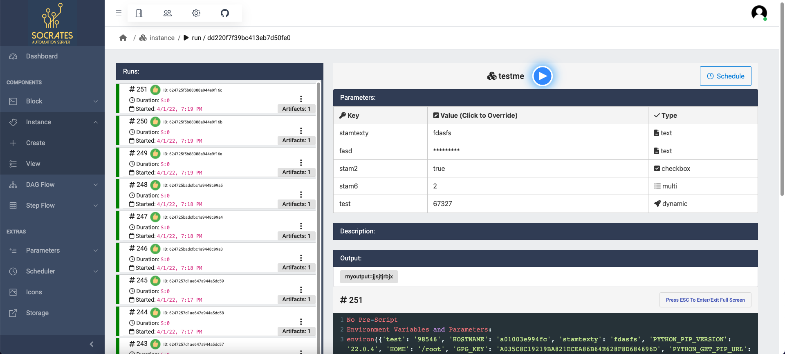

# 🧙♂ What is Socrates?

## _A Simple Automation Server_

Socrates is a simple automation server, inspired by Jenkins. It can run tasks in any code language and present them in a friendly dashboard to non-technical users.

## Features

* Define Parameterized Blocks of code in any language to be run in Docker.
* Define Static and Dynamic parameters to be used by all Blocks.
* Create Instances of code that can be run individually.
* Create Steps and DAG Flows using Instances of code.
* Save Artifacts and Outputs, managed by Minio S3.
* Schedule any component and view it in a timeline.
* Give any component an Icon to categorize them.
* Connect a Github repository with or without a Webhook, automatically update all the code in the server.
* Manage a friendly Developer Portal, give your jobs custom names and folders.
* Can be run on Docker or on Kubernetes

## Components

Socrates's main components are the basic terms that define how to work with the server.

| Component  | Description                                                                                                                                                                                                                                                                                                                                    |
| ---------- | ---------------------------------------------------------------------------------------------------------------------------------------------------------------------------------------------------------------------------------------------------------------------------------------------------------------------------------------------- |
| Block      | Block is a component made of a Code in a specific Language. It might have parameters, defaults, and a Pre-Code to execute before the main. It may also be directly attached to a file in Github. Any files created during execution will be saved as Artifacts, and Outputs can be set by printing following syntax: `::set-output key=value`. |
| Instance   | Instance is attached to a Block. It is essentialy a Parameterized Block, with it's own execution History. Multiple Instance can exist for the same Block. It can be run individually and be scheduled.                                                                                                                                         |
| Steps Flow | Steps Flow is a pipeline of one or more Instances arranged in Steps. They share ENV Variables and Outputs to the next Steps. It has it's own execution history and can be drilled down to individual Instances.                                                                                                                                |
| DAG Flow   | DAG Flow is a pipeline of one or more Instances arranged in a Graph. They share ENV Variables, and pass Outputs to the next Nodes in the Branch. It has it's own execution history and can be drilled down to individual Instances.                                                                                                            |
| Parameters | Parameters can either be private to a Component, or shared between all. Parameters can also be dynamic, by running a small Instance with an Output of an array. This will become a Multi-Choice parameter.                                                                                                                                     |

## License

MIT
